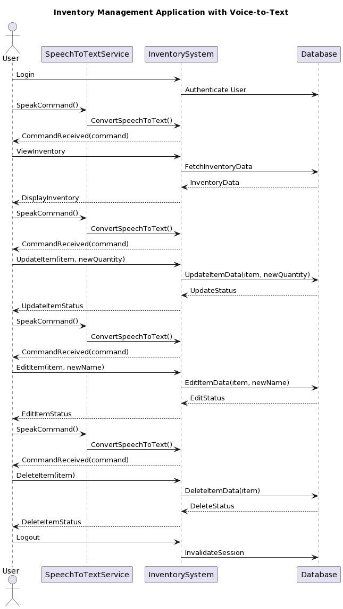
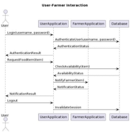
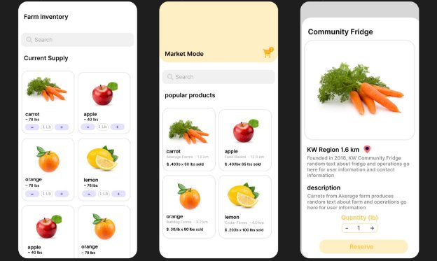

FarmerPro

**Team members:**          Anweshi Anavadya (aanavady) David Mehic (dmehic)

Hamza Saqib (h3saqib) Kevin Liu (k267liu)

Shehryar Suleman (s6sulema) Zayd Adnan (zadnan)

Private Github Repository: <https://github.com/zaydadnan08/CS446>

**What is your project?**

FarmerPro is a versatile mobile tool that enables farmers to efficiently manage their farm operations, track sales, collaborate with community fridges, and do offline inventory management. It also allows users living in the city to quickly check what’s available in their local community fridge.

**Why is it interesting?**

FarmerPro works to fit the needs of farmers such that they can take inventory in a simple process without the use of an internet connection, which is often unavailable in rural areas. This data will then be synced to a centralized database on a network connection to keep all inventory management up to date.

On the other hand, the community fridge mode allows an admin to update inventory and request certain produce from farmers. It acts as a way for the farmers to give back to their community while also meeting the needs of such organizations.

Finally, any city dweller looking for fresh produce can load up the app and conveniently see what’s available in their local community fridge at the moment.

**Describe and justify your project selection.**

There is a strong need for an app such as this in the KW region. With the close proximity of farmers to consumers and an expressed need from local farmers for a way to easily keep track of inventory, there is a need for an app such as FarmerPro.

Although there are products such as KWNow to connect farmers to consumers, these apps are clunky and don’t allow for a direct communication channel between farmers, community fridges and city residents.

**Why does this project make sense in a mobile form factor?**

Farmers need a portable tool to track and manage sales from their day-to-day work schedule, a tool that is accessible to many people for their consumer market, and a tool that offers functionality even while offline. This is achieved through a mobile form factor, that factor being an Android app.

**Functional Properties:**

**Inventory Management:** the app will allow farmers to sign up and update/track the inventory of their farm, the data being saved on a cloud backend system. This will allow them to keep track of their inventory over time and get regular updates from their staff on farm operations. They can also optionally track all their sales on the app to get relevant statistics from the market mode (see below).

**Market:** if a farmer decides to track their sales as part of their inventory management then all the relevant statistics and data will show up here (revenue, profit, etc.) with powerful and intuitive tools to analyze said data to aid in business decisions.

**Community Fridge:** the app will allow community fridges to list the kinds of items they currently require for their community fridge, allowing farmers who want to donate to efficiently support their local community. By being able to identify what products the fridge needs, this will help stop unnecessary waste from donations that aren’t needed. Normal users, who are neither farmers nor community fridge admins, will be able to conveniently see what’s available in their local community fridge and also make requests for certain produce.

**User Scenarios:**

**Farmer user scenario:**

A user who is a farmer can sign up for the app, and get his employees to all sign up. Using the inventory management functional property they can all keep track of and update the farm's inventory while working with limited network connection, allowing for a simplified inventory management experience. The farmer can then use the market feature to track and analyze business statistics over time.

**Community Fridge admin user scenario:**

A community fridge can sign up its employees/volunteers as admins. They’ll be able to update the inventory for the community fridge and place requests for certain produce. Upon placing the request, all nearby farmers who have that produce will get notified if they decide to opt in.

**Regular user scenario:**

A regular user, who may or may not be lower income, can use the app to see what’s currently available in the community fridges around them. They can get reminders for when the community fridge stocks up with new produce, get notified when certain produce arrives, and also place requests for a specific produce they may find themselves being regularly in need of.

**Architectural View:**

Sequence diagram of farmer updating inventory. In this case the user is the farmer (left).

Sequence diagram of Community Fridge admin adding food request. In this case user in the diagram below is the community fridge admin (below)

**Non-functional Properties:**

**Efficiency/Performance:** A farmer should be able to update his inventory within 4 clicks of using the app, each click being easy to click. This is important as when working on the field, farmers aren’t able to do complex tasks with their phones and need a simple flow for their inventory management. By limiting the amount of clicks required and making it as simplified as possible, this allows farmers to quickly update inventory while working in the field.

**Scalability:** multiple users should be able to sign into a single account and all update the inventory of the farm while working. That is, the app will support multiple calls to update the inventory from multiple users on the same account. This is important as farmers often have multiple workers on their farms, and this will allow the workers to individually update the farmers inventory based on their work.

**Dependability:** the app should be usable without any network connection and be able to take updates to the inventory. When the app does gain network connection, this data should be synced with a centralized database. This is an important property as often times when working on a farm, network connection isn’t always available.

**Human Values:**

Social Justice: Our applications aim to support people that are less privileged. The community fridge portion of our application takes account of what is lacking and needed by the public, and attempts to meet their need by taking account of the excess supply of farmers nearby. This will not only provide people in need of food in the KW area but also minimize food waste from farmers and food suppliers nearby.

**Stakeholders:**

Farmers: Farmers will use our application to track their inventory in the home mode and update their inventory in the farm mode. Farmers will also be able to track all their sales transactions in the market mode of the app.

Community Fridge Admin: Admins will use the app to make requests to nearby Farmers to donate food to the community fridge.

Residents of KW region: Residents of the KW region and view what is available in the community fridge and reserve it.

**Mockups:**

Below are mockups for the inventory and market mode pages where farmers can update their inventory. Pages 2 the marketplace works where farmers can view their sales. Page 3 in a view of the community fridge and how KW residents can view what is available in the community fridge and reserve it.

