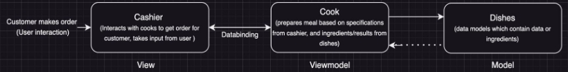
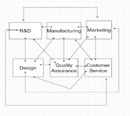

aanavady; dmehic; h3saqib; k267liu; s6sulema; zadnan Group 22

**Architectural design #1 - Repository Style**

***Description of style:***

The Repository style architecture is suitable for applications in which the central issue is establishing, augmenting, and maintaining a complex central body of information. Typically the information must be manipulated in a variety of ways. And often long-term persistence is required. This architectural style is named repository style because the central body of information acts as a repository that stores data long term in a central place and lets other components access the data.

***Example - Automobile Manufacturing:***

- *Car Parts (Data)*: Every physical part of a car, which includes the nuts and bolts to the tires, is an extremely crucial piece of data. Each of these components plays a pivotal role in the final assembly of the vehicles.
- *Inventory System (Repository)*: The inventory management system, or our 'repository', keeps an eye on every car part. It tracks them, fetches them when needed, and constantly updates their status. In a highly advanced setup, this inventory system could be connected digitally to automated systems that bring the parts straight from their storage places.
- *Workers - Engineers/Assembly Line (Clients)*: The engineers, assembly line workers and other personnel throughout the manufacturing plant use this system. They are able to tap into the inventory system (our “repository”) to retrieve any information that they need. This keeps the data extremely accessible and ready for work.

***Reduction of Coupling and Enabling Future Changes:***

The repository pattern in this scenario reduces coupling by decoupling the physical handling and management of the car parts from the inventory tracking system. The clients (workers/personnel) don’t need to be concerned with how and where the parts are stored as long as they have the correct and accurate information about the parts, which is provided by the repository (inventory system). This separation allows for the underlying storage and retrieval mechanisms to change without affecting the manufacturing process. If the plant decided to change and move to a storage system that is more automated or decided to change the supplier for some given part, these changes wouldn’t have any effect on the clients (workers) that interact with this repository (inventory system). This also allows for any future changes and enhancements that the plant could implement. New advancements would help in optimizing the manufacturing process which would increase efficiency of the plant.

***Diagram:***

**Architectural design #2 - MVVM Design Pattern**

***Description of style:***

MVVM or Model, View, View Model is a very common architecture used in mobile applications. The View is our interface which the user will interact with, the view will interact with ViewModel for its business logic and event handling. The ViewModel is responsible for the business logic and notifies the View of state changes. The Model is our data model and can include business logic; the ViewModel will use the Model for handling logic. The Model and View will have little to no interaction with each.

***Example - Fast Food Restaurant:***

- *View: In a fast food restaurant the view is represented by the cashiers. The user will interact with the cashier like a view to order their food. Similar to in MVVM architecture the View or Cashier doesn’t handle the business logic which in our example is the cooking process of the food.*
- *View Model: The ViewModel is represented by the cooks. When the user interacts with the cashier; the cashier/View will communicate with the cooks who are the ViewModel to prepare the order. The cooks, like in the MVVM architecture, are responsible for the business logic of preparing the order.*
- *Model: The model in this example is the dishes. The dishes represent data models which contain the data or ingredients. Like the MVVM architecture the View/Cashier has little to no interaction with the dish/Model. The cashier will only hand the bag to the customer or call customers up to grab their order.*

***Reduction of Coupling and Enabling Future Changes:***

Coupling is reduced from the fast food restaurant example similar to MVVM where coupling is reduced between the VIew and the ViewModel. In our example we can see that the cashier/View is decoupled from the cooks/ViewModel who prepare the food. The process of making the food is not dependent on the cashier at all. The cashiers simply communicate to the cooks who prepare the food entirely. This results in benefits from the MVVM architecture where the ViewModel or cooks can be tested independently from the View/cashiers. If we want to test that the food is meeting the quality we only need the cooks present to do so because their responsibilities are decoupled from the cashiers’. In the fast food restaurant example if there is a change in the way we make a dish then we only need to change the ViewModel or cooking for that dish; the cashier/View in this scenario remains completely unaffected. The MVVM model has a basic and clearly defined structure with simple communication between the independent components, enabling future changes on individual components without disturbing the entire system.

***Diagram:***

**Architectural design #3 - Microservices Architecture Description of style:**

The Microservices architecture style is an architectural style where software systems focus on developing smaller modules/components that perform specific tasks independently and can be combined to collaborate with other modules to make up the entire overarching system. This style is best for complex applications that require scalability.

**Example:**

A real world non-software example of a microservice architecture would be how companies are split up into separate smaller departments to handle different tasks. For example an Engineering company could have various departments such as research and development, manufacturing, design, marketing, quality assurance, and customer service. This organization of the company's structure represents a microservice architecture as each department acts as its own independent and fully functioning unit that has its one specific purpose and organized operations. Each department has a well defined internal ecosystem where it can achieve its goals and sets of specified tasks independent of the other departments. These autonomous and individual departments are able to communicate with one another and work together to form the entire system, which in this case would be the whole company. Customers and potential business partners (clients) will contact the enterprise as a whole (api gateway) and then will be redirected to any of their departments.

**Reduction of Coupling and Enabling Future Changes/Benefits:**

This microservices architecture of organizing a company into different departments is beneficial to the overall company as each team is able to focus on its specific services without interfering with another department. This organization of employees into different departments allows for individual scalability for each department, which is useful if a specific department experiences a large amount of traffic it can be scaled accordingly without affecting the scale of separate departments. This architecture style is also useful because if one department experiences an issue it is isolated and does not affect the workflow of other departments. This current model allows for each department to be scaled individually, and also allows for the potential addition of new departments if new tasks are required. This architecture style reduces coupling as each department is independent of the others allowing for changes within the department to have little to no impact on other departments. The departments focus on their specific tasks and communicate with other departments/modules through well-defined communication protocols. By dividing the system’s task into smaller independent components it creates a loosely coupled system as each module is able to focus on their specific task and not worry about the operation of other modules.

**Diagram :**

