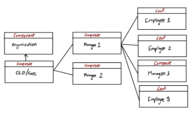
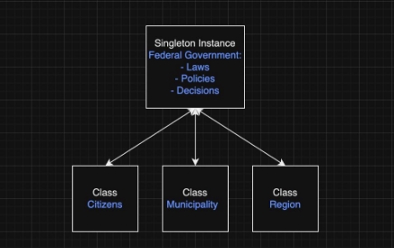
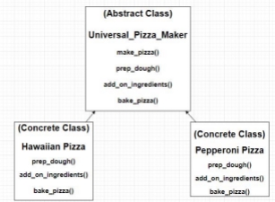

aanavady; dmehic; h3saqib; k267liu; s6sulema; zadnan Group 22

**Design Pattern #1 - Composite design pattern**

***Description:***

The Composite design pattern allows treating individual objects and compositions of objects uniformly. It enables creation of a tree-like hierarchy of objects, where all objects, simple or complex, can be handled consistently, simplifying operations over the object structure.

***Example - Organization hierarchy:***

Consider an organization hierarchy. Each entity in the organization, be it the CEO, manager, or general employee, can be seen as objects. However, a manager or a CEO has subordinates, while a standard employee does not. This makes the manager or CEO have all the same functionalities of a primitive employee (leaf), as well as additional abilities due to their higher level within the organization (composite).

- The Component (organization) interface is implemented by both the Employee (Leaf) and Manager (Composite) classes. The organization sets the standards and rules that the CEO, all employees and managers must conform to.
- An Employee represents a leaf class, having no subordinates. This represents the most basic requirements for a member of this organization.
- A Manager represents a composite class , with the ability to add or remove subordinates (either Manager or Employee objects). The Manager possesses the same abilities as their employees, but also has to manage their subordinates meaning they have additional responsibilities.
- The Manager class maintains a list of its subordinate objects, forming a tree-like hierarchy.
- This structure allows individual objects (Employee) and compositions of objects (Manager) to be treated uniformly, simplifying operations such as completeWork().
- It's easy to adjust the structure with add or remove operations if the internal organization hierarchy changes (e.g., a new subordinate is added).

***Reduction of Coupling and Enabling Future Changes:***

The composite pattern reduces coupling by allowing you to treat individual objects (Employee) and compositions of objects (Manager) uniformly. When calling a method from the OrganizationComponent interface, you don't need to know if it's an Employee (leaf) or a Manager (composite). This structure allows you to easily make future changes. If a new type of employee is introduced, you can simply add a new class implementing OrganizationComponent. If the internal organization structure changes (e.g., a manager gets a new subordinate), it is straightforward to adjust with add or remove operations. This pattern promotes flexibility and extensibility as you can introduce new types of organizational components or change relationships without altering the existing code. Moreover, it simplifies client code by eliminating the need to handle each component differently, contributing to improved maintainability.

***Diagram:***

**Design Pattern #2 - Singleton design pattern**

***Description:***

The Singleton design pattern is when there can be only one instance of a class. The single instance of the class must also be accessible globally. The Singleton design pattern is used in situations where having different instances of a class will result in differences in the objects which can cause issues. Examples are a file manager class or a settings class where having different instances with differences between the objects will result in errors.

***Example - Federal Government:***

Consider a federal government. Similar to a Singleton design pattern there can only be one instance of a government; there must only be one governing body of a nation. Furthermore the governing body like a Singleton instance is accessible globally; for citizens of a country the government is accessible to everyone through voting polls. The federal government is also accessible to other classes like municipalities and regions of a country. As discussed previously a Singleton design pattern is used when multiple instances of a class would cause conflict. For a federal government if there were multiple governing bodies for one nation conflicts would arise if these different groups had different laws and procedures.

***Reduction of Coupling and Enabling Future Changes:***

A Singleton design pattern reduces coupling from global variables. Instead of having many global variables that code is coupled to; we can instead have a Singleton class to manage all of these variables. Similar to our example of a government, if all the individuals of a country were responsible for keeping track of the nation’s laws and decisions, this would be a really messy way to run a country. Instead we opt to have one governing body for a country to keep track and make decisions on policies. Another benefit of a Singleton design pattern is that it can keep all future changes to one class instead of having to manage complexity of having to pass objects and making those changes. Similar to our government example, because all individuals abide by the laws set by the government it makes it easier to change laws and policies if needed. A change in policy only needs to happen once at the federal level and we don’t need to inform each individual of a country to change their own set of laws they abide by.

***Diagram:***

**Design Pattern #3 - Template method design pattern**

**Description:** This design pattern utilizes methods within an abstract class, that define the basic structure of an algorithm to complete a certain task. This defined set of steps acts as the blueprint for subclasses to follow as they complete this task with slightly different specifications. This structure allows each subclass to change certain steps to achieve their own individual goals, without changing the structure of the algorithm itself. This method allows for sharing of common code as each implementation shares the same overall algorithm structure.

**Example - Making a Pizza**

An example of the template method design pattern would be the process of making a pizza. This process can be organized effectively using the template method. The abstract class can be defined as the generic steps that are required to make all pizzas, we will name this class “Universal\_Pizza\_Maker”. This abstract class must contain the template method of “make\_pizza” which will define the structure of our steps for making all the pizzas, as this will call the primitive operations deciding their order. The primitive operations of preparing the dough, adding ingredients/toppings, and cooking the pizza outline the basic steps of making a pizza. These basic steps provide the overall structure of how to make a pizza, and our abstract class is complete. Now the concrete subclasses will have the same primitive operations as the abstract class. Each concrete subclass will be a different type of pizza with different types of ingredients and toppings. For example you could have concrete subclasses of cheese pizza, pepperoni pizza, vegetarian pizza, hawaiian pizza and so on and so forth. All of these pizzas require the same exact steps to be made, however the specific details of which ingredients will be used, and potentially how long the pizza is cooked may vary. This design pattern is beneficial to the overall system as the simple and organized steps of making a pizza allows for simple concrete implementations for new pizzas as the steps will remain the same. The simple steps make it easy and organized for someone to create a wide variety of pizzas as they only need to remember a small amount of steps. This benefit is an analogy to how this design pattern avoids duplicate code, and by reusing common code it makes the overall system more simple and organized.

***Reduction of Coupling and Enabling Future Changes:***

This design pattern reduces coupling as the abstract class allows each concrete subclass to modify the details of each step within the algorithm to fit their needs. The abstract class encapsulates all the common steps shared between the subclasses, allowing each subclass to utilize their own specific changes. This reduces coupling as specific tasks are divided amongst subclasses, making the code modular, flexible, and less coupled. This design pattern allows for simple future changes as a subclass can freely redefine certain steps without any issues. This overall structure also allows for simple addition of future subclasses, as they only need to contain the same primitive operations.
